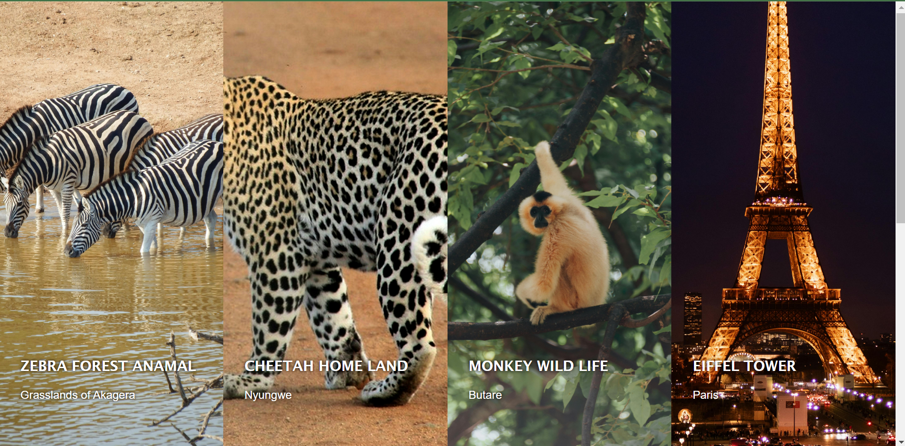
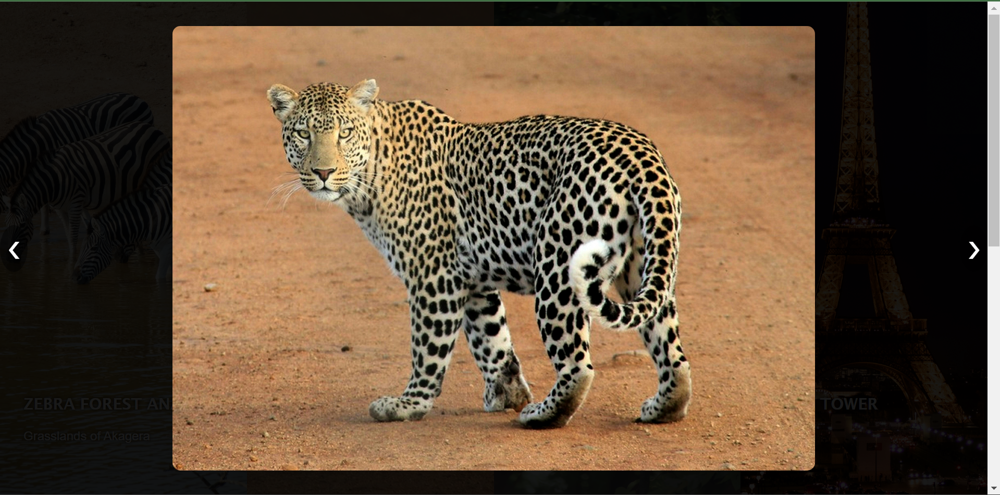

# Interactive Photo Gallery

This project is an interactive photo gallery with fullscreen viewing and image navigation functionality.

## Features

- Responsive design with flexible grid layout.
- Hover effect to zoom in on images.
- Fullscreen image viewing with navigation arrows.
- Adaptive layout for different screen sizes.


## Getting Started

To run this project locally, follow these steps:

1. **Clone the repository**:

    ```sh
    git clone https://github.com/ba-lambert/COA-TASKFORCE-challenge
    ```

2. **Navigate to the project directory**:

    ```sh
    cd interactive-photo-gallery
    ```

3. **Open `index.html` in your browser**:

    You can simply double-click the `index.html` file, or use a web server tool like `Live Server` in VS Code for a better development experience.

## Usage

- Click on any image to view it in fullscreen mode.
- Use the left and right arrows to navigate between images in fullscreen mode.
- Click anywhere outside the image (or on the close button if implemented) to exit fullscreen mode.

## screenshoots
`` Main Screen ``

`` Single Page ``



## Assignment
`` to run questions you have to navigate to questions folder then run node assign1.js/assign2.js via terminal ``
